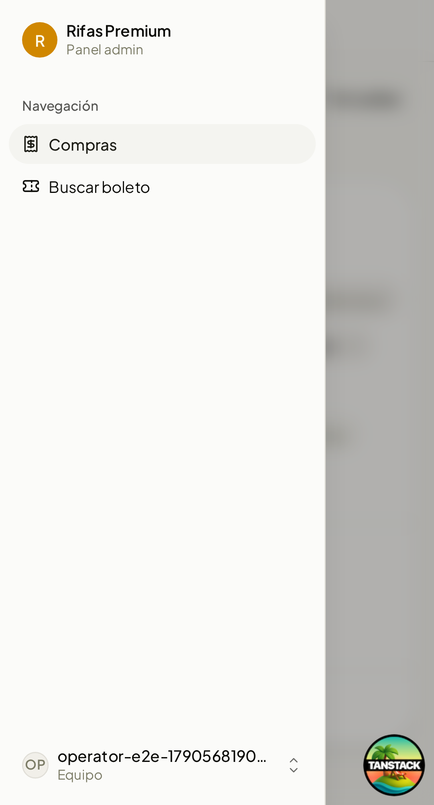
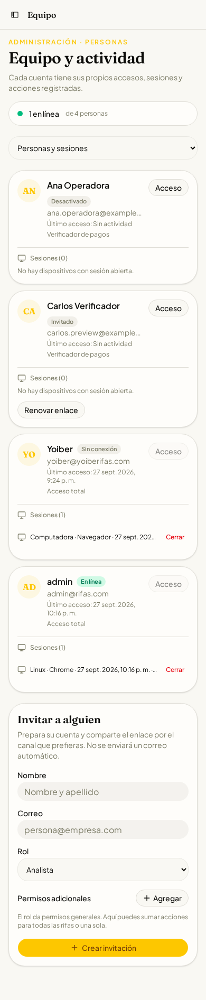
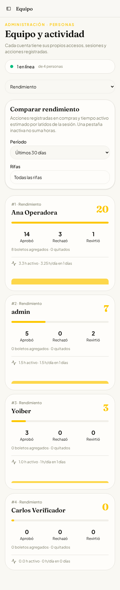
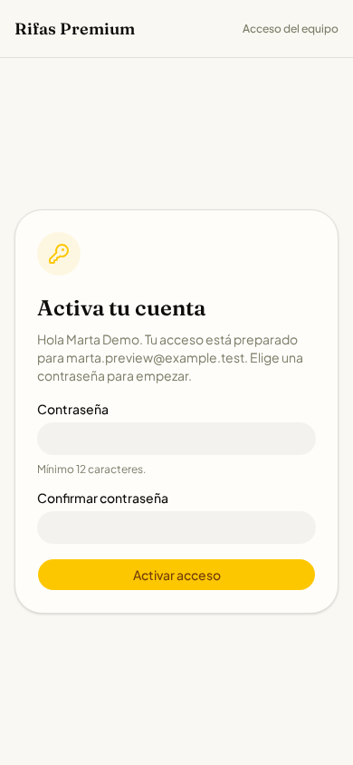

# Acceso del equipo

Cada trabajador usa su propio correo y contraseña. El propietario y el desarrollador tienen `super_admin`; los demás reciben un rol editable y, si hace falta, permisos adicionales para una rifa concreta. No existe registro público.

## Activación

1. Ejecuta `pnpm db:migrate` antes de desplegar la aplicación. Las migraciones `0021` a `0024` agregan cuentas de equipo, límites de intentos, sesiones, actividad, último acceso y nombre visible separado del identificador único legado.
2. Configura `BETTER_AUTH_SECRET`, `BETTER_AUTH_URL` y `APP_URL` para el origen HTTPS real.
3. Ejecuta una vez `pnpm admin:bootstrap-staff` con cuatro variables de entorno: `BOOTSTRAP_DEVELOPER_EMAIL`, `BOOTSTRAP_DEVELOPER_PASSWORD`, `BOOTSTRAP_OWNER_EMAIL` y `BOOTSTRAP_OWNER_PASSWORD`. Cada clave debe tener al menos 12 caracteres. Si el correo ya existe, el script reemplaza su clave por la proporcionada y cierra sus sesiones anteriores. Puedes indicar `BOOTSTRAP_RETIRED_EMAIL` para desactivar la cuenta compartida antigua, después de confirmar que las dos cuentas nuevas funcionan. No imprime claves.
4. Entra en **Equipo** desde el panel. Crea o edita un rol, prepara a la persona con su nombre, correo y permisos, y copia el enlace de invitación. Envíalo manualmente por un canal privado.

`pnpm db:seed` sigue siendo solo para desarrollo: crea `admin@rifas.com` y `yoiber@yoiberifas.com`, además de tres roles de ejemplo. El owner recibe una clave aleatoria si no defines `SEED_OWNER_PASSWORD`; las claves no se imprimen. No ejecutes `SEED_FORCE=1` sobre datos reales.

## Modelo de acceso

| Capa | Regla |
| --- | --- |
| Identidad | Better Auth 1.6 con adaptador Drizzle para libSQL. Correo y clave. `disableSignUp` impide crear cuentas desde `/api/auth/sign-up/email`. |
| Rol | Plantilla editable de permisos generales en `staff_roles`. `super_admin` tiene acceso total; el rol legacy `admin` mantiene operaciones administrativas excepto gestionar el equipo. |
| Excepción | `staff_grants` suma un permiso a una persona en todas las rifas o en una rifa. No resta permisos del rol. Usa un rol sin ese permiso para restringirlo a una rifa. |
| Recurso | Las mutaciones de compras y rifas resuelven su rifa antes de autorizar. Los listados requieren lectura general para evitar filtrar datos por error. Las rutas no catalogadas se deniegan a trabajadores. |
| Baja | Desactivar la cuenta borra sus sesiones. Better Auth comprueba el estado al crear sesión y las APIs lo verifican de nuevo en cada petición. No hay caché de sesión en cookie. |

El rol integrado **Operador de compras** solo abre **Compras** y **Buscar boleto** (además de **Mi cuenta** para cambiar su clave). Puede aprobar, rechazar, revertir y ajustar boletos según sus permisos de compras, pero nunca recibe acceso a Inicio, Rifas, Análisis, Configuración ni Equipo, incluso si un permiso antiguo o adicional quedó guardado. Para ampliar el trabajo de alguien a otras secciones, crea otro rol. La migración `0025` retira de este rol los permisos ajenos a compras en las instalaciones existentes; no cambia los otros roles.

Las cuentas creadas por Better Auth reciben el rol `customer` por defecto, incluso sobre bases antiguas cuyo valor SQL predeterminado era `admin`. Hoy el registro está deshabilitado; esta defensa evita que una futura activación del registro público conceda accesos administrativos accidentalmente.
El nombre visible es independiente del `username` único legado: dos trabajadores pueden compartir nombre, pero nunca correo.

La política vive en `app/src/lib/workforce-policy.ts`. Toda ruta administrativa nueva debe tener una acción en `permissionForAdminRequest`; las server functions usan `adminPermissionMiddleware`. Las decisiones finales siempre se toman en el servidor, no en la visibilidad del menú.

## Invitaciones y sesiones

El enlace contiene un token aleatorio de 256 bits en el fragmento `#token=`, no en la URL enviada al servidor. Solo se guarda su SHA-256. Caduca a los siete días y se consume una vez. Puede renovarse mientras la invitación esté pendiente. La persona define una clave de 12 a 128 caracteres; no se envía correo automáticamente.

El panel muestra dispositivo, último acceso y sesiones vigentes. El propietario puede cerrar una sesión puntual. Una persona figura «En línea» si un latido llegó durante los últimos dos minutos. Los latidos se envían cada minuto únicamente con la pestaña visible y actividad reciente; los intervalos mayores a 90 segundos no suman tiempo. Las horas son una **estimación de uso activo**, no un control de asistencia laboral exacto. Se agregan por día UTC.

## Auditoría y ranking

Las aprobaciones, rechazos, reversos, cambios de boletos y datos del comprador insertan eventos en la misma transacción que el cambio. No se guardan datos personales del comprador en el evento; sí el actor, la rifa, la compra y metadatos no sensibles. El resto de las mutaciones administrativas se anotan después de responder satisfactoriamente; si esa anotación falla, se registra el fallo sin ocultar la operación ya completada. Las altas, bajas, roles y sesiones también generan eventos.

**Rendimiento** compara cantidad de acciones y boletos agregados/quitados por persona, con filtro de una o varias rifas y período. Las horas activas reflejan toda la plataforma, aunque se filtre por rifa. El registro de actividad permite filtrar por persona.

No se implementan cuentas de compradores ni envío automático de invitaciones en esta versión.

## Vista móvil

Capturas del panel a 390 px, con cuentas y actividad de demostración en una base local aislada:

